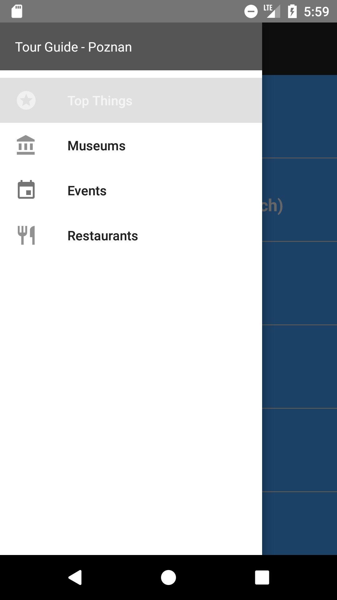
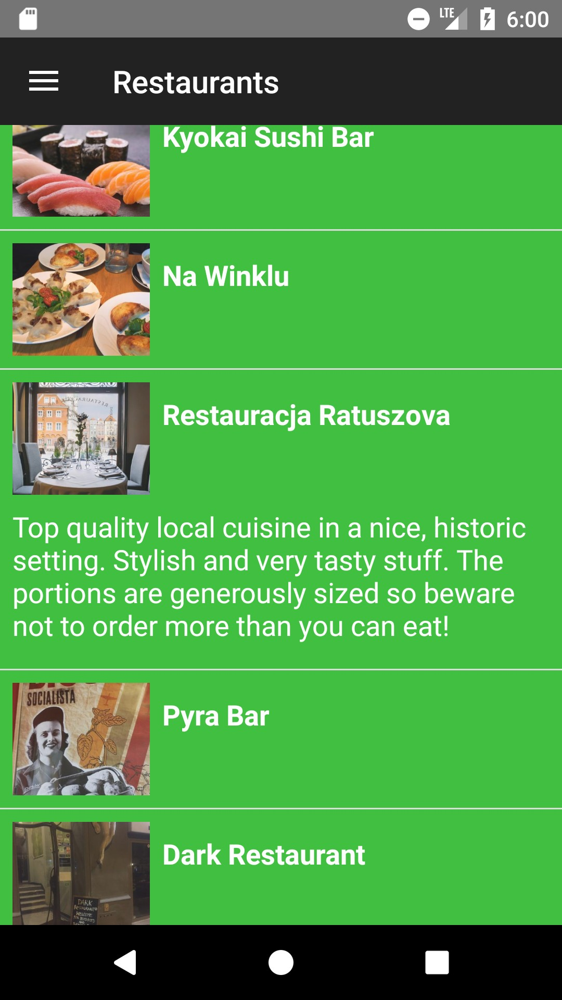

# Tour Guide App

Project #5 for Android Basics by Google Nanodegree Program

<h3>Layout</h3>
<table>
  <tr>
    <th>Criteria</th>
    <th>Meets Specifications</th>
  </tr>
  <tbody>
    <tr>
      <td>
        
Overall Layout

      </td>
      <td>
        
App contains at least 4 lists of relevant attractions for a location

      </td>
    </tr>
    <tr>
      <td>
        
Navigation

      </td>
      <td>
        
User navigates between lists in Fragments using either a Navigation Drawer or a ViewPager plus TabLayout.

      </td>
    </tr>
    <tr>
      <td>
        
List Item Contents

      </td>
      <td>
        
Each list item contains information about an event, restaurant, historical site, or similar.

      </td>
    </tr>
    <tr>
      <td>
        
Pictures

      </td>
      <td>
        
At least one list includes pictures of the location.

      </td>
    </tr>
    <tr>
      <td>
        
Layout Best Practices

      </td>
      <td>
        
The code adheres to all of the following best practices:

        <ul>
          <li>Text sizes are defined in sp</li>
          <li>Lengths are defined in dp</li>
          <li>Padding and margin is used appropriately, such that the views are not crammed up against each other.</li>
        </ul>
      </td>
    </tr>
  </tbody>
</table>

<h3>Functionality</h3>
<table>
  <tr>
    <th>Criteria</th>
    <th>Meets Specifications</th>
  </tr>
  <tbody>
    <tr>
      <td>
        
Location Object

      </td>
      <td>
        
App contains a custom object for storing location information .

      </td>
    </tr>
    <tr>
      <td>
        
Custom Adapter

      </td>
      <td>
        
App uses a custom adapter to populate the layout with views based on instances of the custom class.

      </td>
    </tr>
    <tr>
      <td>
        
String Storage

      </td>
      <td>
        
All strings are stored in the strings.xml resource file.

      </td>
    </tr>
    <tr>
      <td>
        
Image Storage

      </td>
      <td>
        
All images are stored as drawables.

        
All drawables are stored at multiple densities.

      </td>
    </tr>
    <tr>
      <td>
        
Errors

      </td>
      <td>
        
The code runs without errors.

      </td>
    </tr>
  </tbody>
</table>

<h3>Code Readability</h3>
<table>
  <tr>
    <th>Criteria</th>
    <th>Meets Specifications</th>
  </tr>
  <tbody>
    <tr>
      <td>
        
Readability

      </td>
      <td>
        
Code is easily readable so that a fellow programmer can understand the purpose of the app.

      </td>
    </tr>
    <tr>
      <td>
        
Naming Conventions

      </td>
      <td>
        
All variables, methods, and resource IDs are descriptively named so that another developer reading the code can easily understand their function.

      </td>
    </tr>
    <tr>
      <td>
        
Formatting

      </td>
      <td>
        
The code is properly formatted:

        <ul>
          <li>No unnecessary blank lines</li>
          <li>No unused variables or methods</li>
          <li>No commented out code</li>
        </ul>
        
The code also has proper indentation when defining variables and methods.

      </td>
    </tr>
  </tbody>
</table>

<em>Requirements copied from: <a href="http://udacity.com">udacity.com</a>.</em>

 

 
  
  

